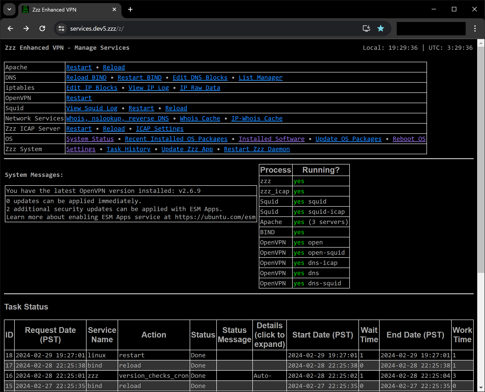
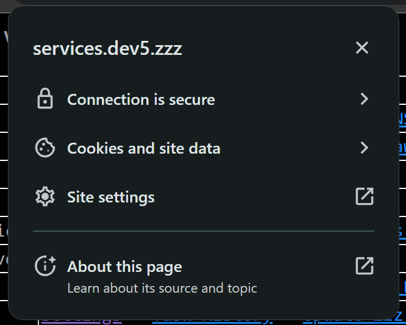
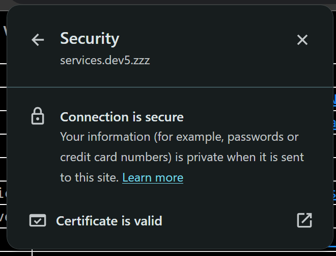
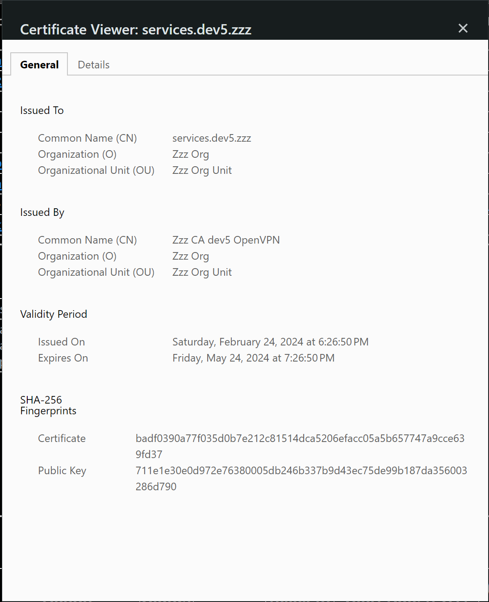
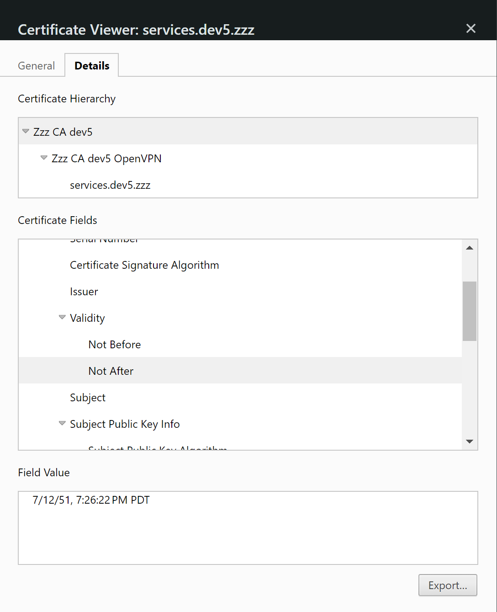
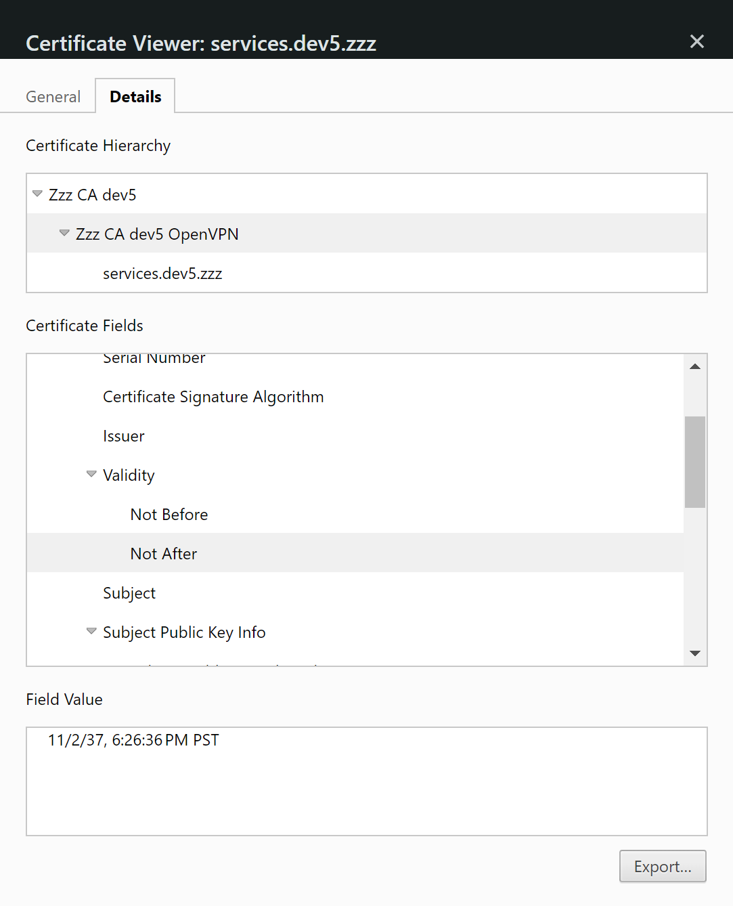
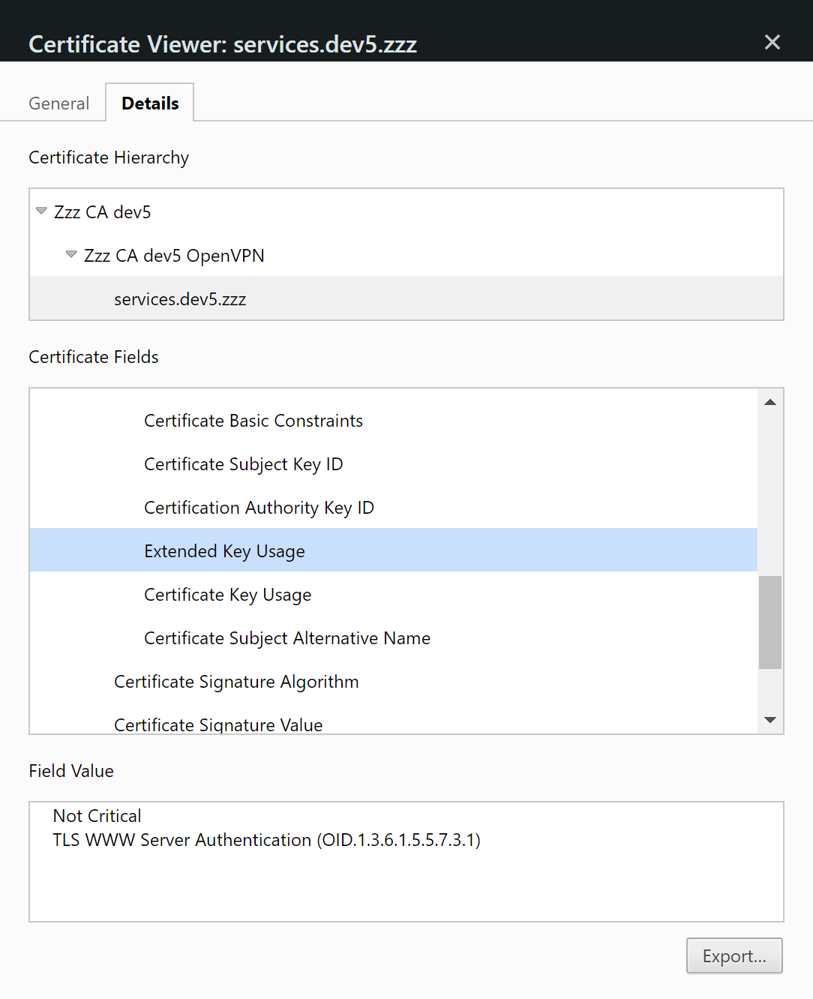
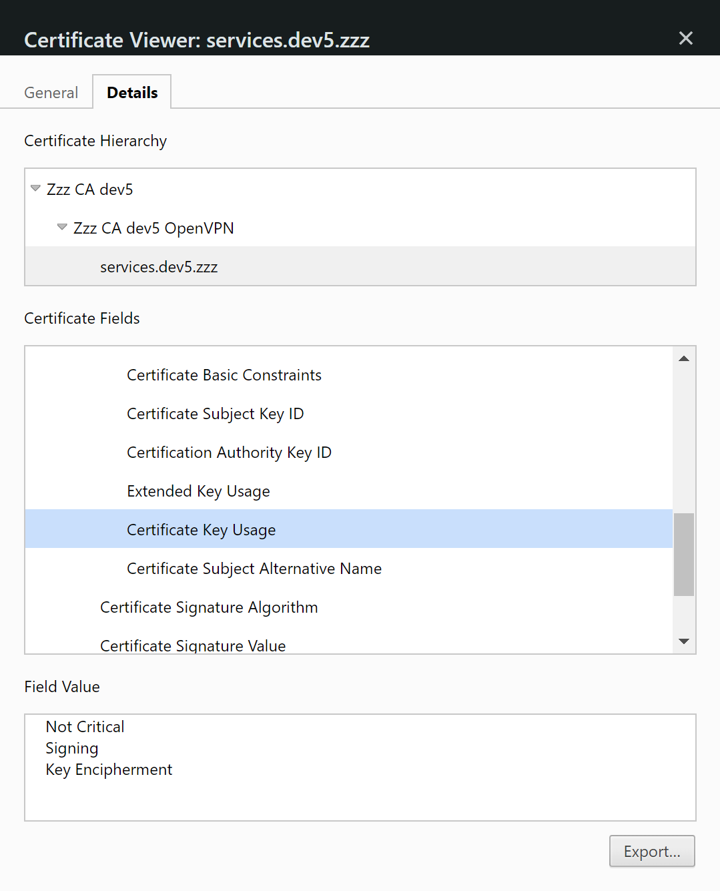
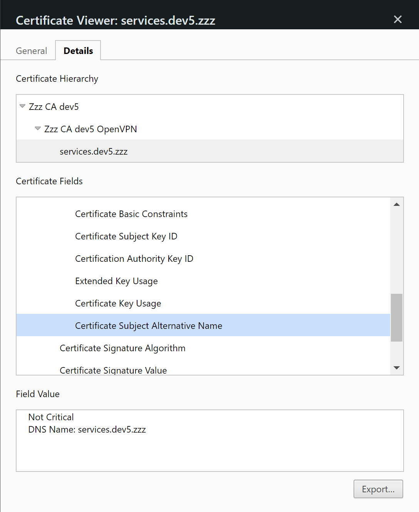

# Zzz Enhanced VPN

**See [INSTALL.txt](INSTALL.txt) for server setup instructions**

Ubuntu-based router and OpenVPN server, with custom analysis tools, IP-blocking, DNS-based domain blocking.
* Blocking groups of IPs by country. Allow/deny IPs individually or by CIDR groups.
* Monitoring traffic by IP and domain. Create and edit custom DNS blocklists based on monitored connections.
* Auto-generation of a self-signed root certificate authority (CA) cert, with intermediate CAs and client/server certs used to provide secure access to the management webpage and VPN.
* SSL-intercepting proxy with a custom ICAP server to apply user-generated custom regular expressions for real-time content editing of browser pages.
* Content Security Policy (CSP) strict enforcement on router management website.
* Multiple VPN servers with different monitoring/blocking levels applied.
* Viewing IP packet metadata.
* Customize block lists by monitoring your web traffic and selecting IPs or domains to block.
* Override IP block lists with allowed-IPs.

### VPN Servers available:
* open: no blocking, log IPs
* open-squid: no blocking, log IPs and hostnames
* dns: block IPs and domains, log IPs
* dns-squid: block IPs and domains, log IPs and hostnames
* dns-icap: block IPs and domains, log IPs and hostnames, apply ICAP regex content changes

**See [USAGE.txt](USAGE.txt) for some command-line maintenance issues.**

## Traffic Flow for Each VPN

**open:**\
    client browser <--> openvpn <--> BIND(DNS-open)\
    client browser <--> openvpn <--> website

**open-squid:**\
    client browser <--> openvpn <--> BIND(DNS-open)\
    client browser <--> openvpn <--> squid(log the hostname) <--> website

**dns:**\
    client browser <--> openvpn <--> BIND(DNS-block)\
    client browser <--> openvpn <--> website

**dns-squid:**\
    client browser <--> openvpn <--> BIND(DNS-block)\
    client browser <--> openvpn <--> squid(log the hostname) <--> website

**dns-icap:**\
client browser <--> openvpn <--> BIND(DNS-block)\
client browser <--> openvpn <--> squid(log the hostname, SSL intercept) <--> website\
squid(SSL intercept) <--> ICAP (request and response processing)\
*note: squid uses an internal connection to the ICAP daemon to send data to the daemon for processing of regex rules set in the ICAP Settings page*

---

## Admin Web Pages:

Index page:\
https://services.zzz.zzz/z/

The URL may be different if you edited the default domain in zzz.conf. The "zzz" TLD may not exist in global DNS, but it works OK on the server once you are connected as a VPN client. The local DNS server hosts the TLD just for this server. \
It will load OK in browsers after completing the server setup process in [INSTALL.txt](INSTALL.txt)

---

Settings page:

Select countries and top-level domains(TLDs) to block.\
Set allowed IPs (overrides blocked IPs)

---

Squid Log page:

Review domains from traffic recorded while connected to squid-enabled VPNs: open-squid, dns-squid, dns-icap.\
Customize DNS blocks based on the recorded domain names.

---

IP Log page:

Review IPs from traffic recorded while connected to any of the 5 VPNs.\
Customize IP blocks based on the recorded IPs.

---

ICAP Settings page:

Use regular expressions to apply content changes to individual domains or all sites.

---

Auto-Generated Self-Signed SSL Certificate Hierarchy:
* Root certificate authority(CA)
    * OpenVPN CA
        * apache webserver cert - 1-year expiration, re-generated monthly, auto-generated certificate revocation list(CRL) for old certs
        * openvpn user(s) - long expiration, auto-generated CRL for deleted users
    * Squid Top CA
        * Squid CA (re-generated monthly to prevent expiration)
            * webserver certs auto-generated by squid-cache when using the ICAP VPN

---

**Index Page:**

---

**SSL Cert structure for apache:**

---

